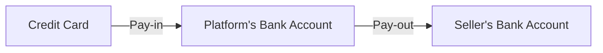

# [System Design] Payment system

## High-level Design

- Payment service
Risk check: risk check, compliance with regulations, check money laundering or financing of terrorism.
- Ledger
Keep a financial record of the payment transaction. Important in post-payment analysis, such as calculating the total revenue of the e-commerce website or forecasting future revenue.
- Wallet
Keep the account balance of the merchant.

## Double-entry ledger system

To accurate bookkeeping.

Record every payment transaction into two separate ledger accounts with the same amount.

## Hosted payment page

Storing credit card info, companies need to deal with complex regulations.

Use hosted credit card pages provided by PSPs. For websites, it is a widget or an iframe, while for mobile applications, it may be a pre-built page from the payment SDK.

## Reconciliation

Ensure correctness.

Every night the PSP or banks send a settlement file to their clients. The settlement file contains the balance of the bank account, together with all the transactions that took place on this bank account.

May need the finance team to perform manual adjustments.

## Handing payment processing delays

Situations where a payment request would stall:

- PSP deems a payment request high risk and requires a human to review it
- A credit card requires extra protection

Solution:

- PSP returns a pending status and displays that to the user. Clients provide a page for the customers.
- PSP tracks the pending payment and notifies the payment service of any status update via the webhook.

## Exactly-once delivery

At-least-once (Retry) + at-most-once.

### Idempotency

Use a UUID as an idempotency key (usually the shopping cart ID). 

If the payment system has already seen the key, return the latest status.